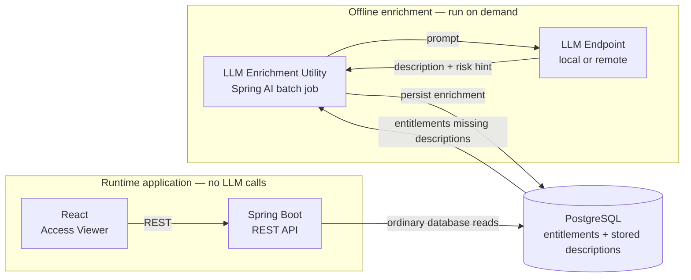

# Entitlement Access Viewer

**Proof of concept: offline LLM enrichment for human-readable access reviews**

## Overview

Enterprise identity and access management systems often expose access as cryptic entitlement identifiers such as:

```text
SAP_FI_GL_APRV_L3
MF_CICS_TXN_UPD_DDA
UNIX_SUDO_DBA_PROD
```

These identifiers may be meaningful to application specialists, but they are difficult for administrators, managers, and auditors to interpret during an access review.

This proof of concept demonstrates a simple architectural pattern:

> **Use an LLM to enrich entitlement metadata offline, store the result, and let the application consume it like ordinary reference data.**

The LLM is **not** part of the application's request path.

Descriptions are generated in a separate batch process and persisted in PostgreSQL. The running application consists of a conventional React UI, Spring Boot API, and database.

## The problem

Understanding what an entitlement actually grants often requires knowledge of the source application, naming conventions, and supporting metadata.

That creates several problems during access reviews:

- reviewers spend time translating system-specific identifiers;
- privileged access may not be immediately obvious;
- reviewers become dependent on application specialists;
- inconsistent interpretation can reduce review quality;
- potentially concerning combinations of access can be harder to recognize when the underlying entitlements are opaque.

For example, the meaning of:

```text
SAP_TREASURY_WIRE_INIT
SAP_TREASURY_WIRE_APRV
```

is much clearer when each entitlement carries a plain-English explanation.

This POC focuses on making individual entitlements understandable. It does **not** yet implement policy-based segregation-of-duties analysis across a user's complete access set.

## Key design decision: generate once, read many

A straightforward AI implementation might call an LLM whenever a reviewer opens or hovers over an entitlement.

This POC deliberately does something different.

The entitlement catalog is enriched **offline**:

1. Find entitlements that do not yet have descriptions.
2. Send their existing metadata to an LLM.
3. Generate:
   - a concise plain-English description; and
   - an optional entitlement-level risk hint for clearly privileged or sensitive access.
4. Store the generated result in PostgreSQL.
5. Serve that stored information through the normal application API.

Once enrichment has completed, viewing an entitlement requires **no LLM call**.

This removes LLM inference latency and per-view inference cost from the interactive application and allows the runtime system to continue operating independently of the model.

## Architecture



The important boundary is the separation between **offline enrichment** and **runtime access review**.

The Spring Boot API never invokes the model. It simply joins each user's access with descriptions already stored in the database.

The LLM utility is also packaged as a separate Docker Compose project rather than as a service in the application stack.

## What is implemented

| Component | Purpose | Technology |
|---|---|---|
| [`db/`](db) | Entitlement catalog, users, grants, and generated descriptions | PostgreSQL |
| [`backend/`](backend) | REST API for users and their entitlement access | Java 25, Spring Boot 4.1 |
| [`frontend/`](frontend) | Access-review UI with generated descriptions and risk hints | React, Vite |
| [`llm-utility/`](llm-utility) | On-demand offline description generation | Spring AI, OpenAI-compatible LLM endpoint |

The sample dataset contains:

- 5 enterprise applications;
- 25 entitlements;
- 6 users;
- a mixture of routine and privileged access; and
- deliberately interesting access combinations for demonstrating the review experience.

## Demo flow

The POC can be demonstrated in two stages.

### 1. Start the application

From the repository root:

```bash
docker compose up -d --build
```

Open:

```text
http://localhost:5173
```

The application displays users and their entitlements.

If an entitlement has not yet been enriched, the UI indicates that no generated description is available.

### 2. Run offline enrichment

The LLM utility is a separate Compose project:

```bash
cd llm-utility
docker compose run --rm llm-utility
```

The utility:

- reads entitlements that are still missing descriptions;
- generates descriptions one entitlement at a time;
- stores the generated description, optional risk hint, model name, and generation timestamp;
- exits when processing is complete.

Refresh the browser after the utility completes.

The same access records now expose plain-English descriptions and risk indicators in the UI.

No LLM is invoked when those descriptions are subsequently viewed.

## Incremental enrichment

The batch utility is safe to run again.

It selects only entitlements that do not already have a corresponding row in `entitlement_descriptions`.

That means a future catalog refresh can add new entitlements and the utility can enrich only the newly added records rather than regenerating the entire catalog.

Failed individual items also remain eligible for a later retry.

## LLM configuration

The checked-in POC uses a local vLLM deployment with Qwen3.5, but the application code talks to the model through Spring AI's OpenAI-compatible client.

The model connection is controlled through environment variables:

| Variable | Purpose |
|---|---|
| `OPENAI_BASE_URL` | Base URL of the OpenAI-compatible model endpoint |
| `OPENAI_API_KEY` | API credential where required |
| `OPENAI_MODEL` | Model identifier exposed by the endpoint |

For the verified local vLLM setup in this POC, `OPENAI_BASE_URL` is the server root, for example:

```text
http://model-host:8000
```

The LLM provider affects only the offline enrichment utility. Changing it does not change the frontend or backend architecture.

See [`llm-utility/README.md`](llm-utility/README.md) for implementation and execution details.

## What the POC demonstrates

The implementation validates the core pattern end to end:

- cryptic entitlement metadata can be translated into useful plain-English descriptions with an LLM;
- enrichment can happen outside the interactive application;
- generated content can be persisted and reused;
- the runtime API can remain a conventional deterministic database-backed service;
- a local model can perform the enrichment without requiring a cloud inference dependency;
- the enrichment utility can be rerun incrementally as the catalog changes.

The result is effectively a small **semantic enrichment layer** over an existing entitlement catalog.

## Scope and limitations

This is intentionally a proof of concept rather than a production IAM platform.

### Included

- entitlement catalog and user-access data;
- offline LLM enrichment;
- stored descriptions;
- entitlement-level risk hints;
- basic generation provenance;
- REST API;
- browser-based access viewer;
- local-model execution;
- incremental batch processing.

### Not implemented

- authentication or authorization for the POC application;
- human approval or editing of generated descriptions;
- policy-driven segregation-of-duties evaluation;
- user-level risk scoring;
- entitlement lifecycle or certification workflows;
- automated ingestion from an IAM platform;
- model-output governance and approval workflows;
- production deployment, monitoring, or operational controls.

In a production design, generated descriptions should normally pass through an approval or governance step before becoming authoritative review metadata.

Cross-entitlement SoD analysis should likewise be implemented as a separate deterministic policy capability rather than inferred from isolated entitlement descriptions.

## Repository structure

```text
entitlements-poc/
├── db/
│   └── init.sql
├── backend/
│   ├── src/
│   ├── pom.xml
│   └── README.md
├── frontend/
│   ├── src/
│   ├── package.json
│   └── README.md
├── llm-utility/
│   ├── src/
│   ├── compose.yaml
│   ├── pom.xml
│   └── README.md
├── compose.yaml
└── README.md
```

The root Compose project contains the runtime application stack.

`llm-utility` intentionally remains a separate project because AI enrichment is an offline data-preparation activity, not a runtime application dependency.
