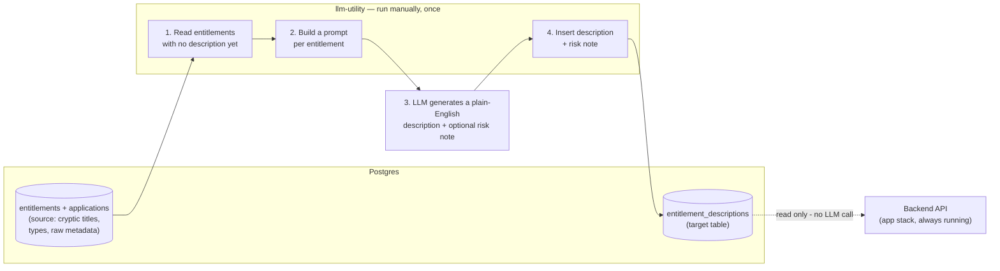

# Entitlement Access Viewer

**A working prototype: what if cryptic access-control entitlements explained
themselves — without a live LLM call every time someone looks?**

## The problem

Enterprise identity and access management systems track thousands of entitlements
across dozens of applications — and almost all of them look like this:

```
SAP_FI_GL_APRV_L3
MF_CICS_TXN_UPD_DDA
UNIX_SUDO_DBA_PROD
```

When an administrator or auditor reviews what access a user actually has, these
codes are meaningless without asking someone who happens to know the system. That
makes access reviews slow, and makes it easy to miss real risk — like a user who
holds both "initiate wire transfer" and "approve wire transfer," a classic
segregation-of-duties conflict hiding behind two cryptic strings that don't obviously
relate to each other.

## The idea

Generate the plain-English descriptions **once, offline, in batch** — not live, on
every page view. An LLM reads the entitlement catalog, writes a description and an
optional risk note for anything meaningfully privileged, and the result is stored in
a database table. The UI just does a normal read. No API latency, no per-view cost,
no dependency on an LLM being available (or even running in the cloud) at the moment
someone's doing their job.

## What's actually built here

| Piece | What it does | Stack |
|---|---|---|
| [`db/`](db) | Schema + realistic seed data (25 entitlements, 6 users, intentional SoD conflicts) | PostgreSQL |
| [`backend/`](backend) | REST API serving users and their access, joined against generated descriptions | Java 25, Spring Boot 4.1 |
| [`frontend/`](frontend) | Access list UI with hover tooltips showing descriptions + risk flags | React 19, Vite |
| [`llm-utility/`](llm-utility) | Standalone, run-once batch job that generates the descriptions | Spring AI 2.0, local vLLM (Qwen3.5) or any OpenAI-compatible provider |

Each piece has its own README with setup details. The `llm-utility` is deliberately
**isolated** from the app stack — its own Compose project, no shared network, nothing
that would ever ship as part of a running deployment. It's tooling, not product.

## Try it

```bash
docker compose up -d          # Postgres + backend + frontend
cd llm-utility
docker compose run --rm llm-utility   # generates descriptions (run once)
```
Then open `http://localhost:5173`.

## LLM configuration

The core architectural claim of this prototype: **the app stack never calls an LLM.**
The LLM only runs inside a separate, manually-triggered batch job that writes to the
database once — the running application just reads what's already there.



Steps 1-4 all happen inside `llm-utility`, run manually, once (or again later if new
entitlements are added). Step 3 is the only step that leaves the machine at all - a
single prompt per entitlement, to whichever LLM is configured. The app stack's only
connection to any of this is the dashed line at the bottom: a plain read of
`entitlement_descriptions`, no LLM call, no dependency on `llm-utility` running or
even existing.

The `llm-utility` talks to whatever LLM you point it at via Spring AI's
OpenAI-compatible client — meaning it works against **any server that speaks the
OpenAI API shape**: a local vLLM/Ollama/LM Studio server, or a real cloud provider.
Switching is an environment variable change, not a code change.

**This repo is configured to default to a local vLLM server** — no API key, no cloud
dependency, no per-call cost:

| Variable | Default here | What it controls |
|---|---|---|
| `OPENAI_BASE_URL` | `http://192.168.1.251:8000/v1` | The server to talk to. **Must include `/v1`** for vLLM and most self-hosted OpenAI-compatible servers — unlike `api.openai.com`, where Spring AI adds `/v1` automatically, custom URLs are used literally. |
| `OPENAI_API_KEY` | `not-needed` | Local servers generally don't check this. |
| `OPENAI_MODEL` | `qwen/qwen3.5` | Must match a model ID the server actually serves — check `GET <base-url>/v1/models`. |

To point at a different server (local or cloud), copy `llm-utility/.env.example` to
`llm-utility/.env` and set these three — nothing else needs to change. This was also
validated earlier in development against Claude (Anthropic's API) using Spring AI's
Anthropic starter instead of the OpenAI one — swapping providers entirely is a
one-dependency, few-line-of-config change, not a rewrite.

See [`llm-utility/README.md`](llm-utility/README.md) for the full picture, including
how the utility is deliberately isolated from the app stack as its own Compose
project.

## Status and honest limitations

This is a **proof of concept**, not a production system:
- No authentication/authorization on the API.
- Generated descriptions and risk notes are not reviewed by a human before display —
  a real deployment would want an approve/edit step before trusting LLM output in an
  access-review workflow.
- The seed data's risk scenarios are hand-picked to be findable; real entitlement
  catalogs are messier.
- Built on very recent framework versions (Java 25, Spring Boot 4.1, Spring AI 2.0) as
  an exercise in working with current tooling — a production build would likely anchor
  to LTS versions instead.

What it does prove: the core idea works, end to end, against both a cloud LLM
(Claude) and fully local infrastructure (vLLM), with no code changes required to
switch between them.
