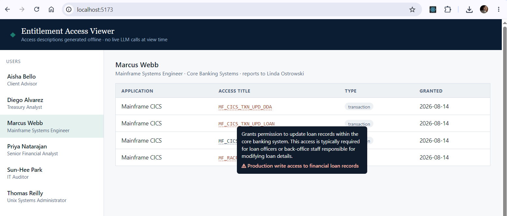

# Entitlement Access Viewer — Frontend

React UI for demonstrating how offline-generated entitlement descriptions can improve an access-review experience without placing an LLM in the interactive request path.

## Role in the architecture

The frontend talks only to the Spring Boot REST API.

It has no model configuration and no direct or indirect LLM dependency at view time.

For each selected user, the UI displays the user's entitlement access. Hovering over a cryptic entitlement title shows the plain-English description previously generated by `llm-utility` and stored in PostgreSQL.

If a stored entitlement-level risk hint exists, the entitlement is visually flagged and the hint is shown in the tooltip.

## Example screen



## Stack

- React 19
- Vite
- static production build served by nginx in Docker

## Run with the application stack

From the repository root:

```bash
docker compose up -d --build
```

Open:

```text
http://localhost:5173
```

The UI shows:

- users in the left-hand pane;
- the selected user's entitlement access;
- source application, entitlement code, type, and grant date;
- generated descriptions on hover;
- entitlement-level risk hints where present.

## Before and after enrichment

Before `llm-utility` has generated a description, the UI deliberately shows a fallback message rather than leaving the tooltip empty.

After the offline enrichment job runs, refresh the page. The same entitlements now display their stored descriptions.

No LLM request is made by the browser or backend when the description is viewed.

## Local development

With the backend available at `http://localhost:8080`:

```bash
cd frontend
npm install
npm run dev
```

Open:

```text
http://localhost:5173
```

The Vite development server is pinned to port `5173` because the backend POC CORS configuration allows that origin.

## API configuration

The frontend defaults to:

```text
http://localhost:8080/api
```

Override it with `VITE_API_BASE` when needed.

## Main source files

- `src/App.jsx` — user selection and access table
- `src/Tooltip.jsx` — description/risk tooltip
- `src/api.js` — REST API wrapper
- `src/index.css` — POC presentation styles

## POC limitations

This UI is a demonstration surface, not a production access-certification application.

It does not implement authentication, approval workflows, entitlement remediation, user-level risk scoring, or policy-driven SoD analysis.
